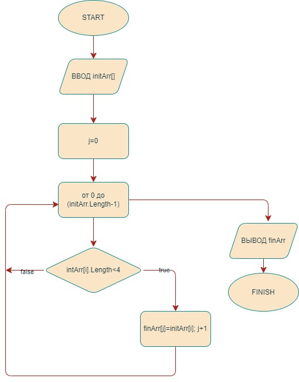

1. Создать репозиторий на GitHub;

2. Нарисовать блок-схему алгоритма;
;

3. Снабдить репозиторий оформленным текстовым описанием решения (файл README.md);

4. Написать программу, решающую поставленную задачу;

5. Использовать контроль версий в работе над этим небольшим проектом.